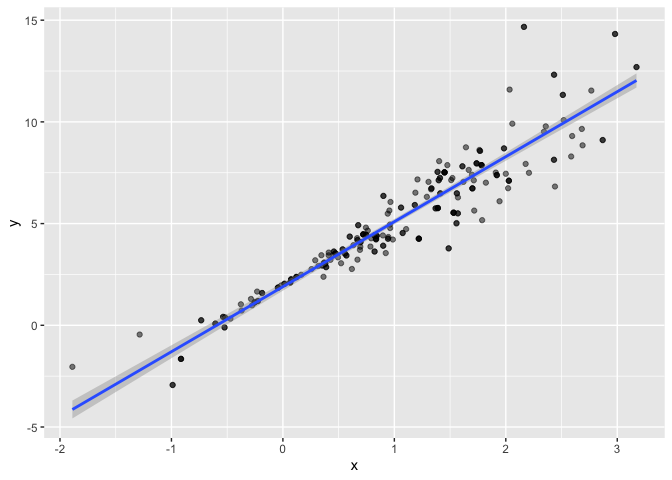

Bootstrap
================
Juliet Rowe
2023-11-09

## Load key packages

``` r
library(tidyverse)
```

    ## ── Attaching core tidyverse packages ──────────────────────── tidyverse 2.0.0 ──
    ## ✔ dplyr     1.1.2     ✔ readr     2.1.4
    ## ✔ forcats   1.0.0     ✔ stringr   1.5.0
    ## ✔ ggplot2   3.4.2     ✔ tibble    3.2.1
    ## ✔ lubridate 1.9.2     ✔ tidyr     1.3.0
    ## ✔ purrr     1.0.1     
    ## ── Conflicts ────────────────────────────────────────── tidyverse_conflicts() ──
    ## ✖ dplyr::filter() masks stats::filter()
    ## ✖ dplyr::lag()    masks stats::lag()
    ## ℹ Use the conflicted package (<http://conflicted.r-lib.org/>) to force all conflicts to become errors

``` r
library(modelr)
library(p8105.datasets)

set.seed(1)
```

## Generate a relevant example

``` r
n_samp = 250

sim_df_const = 
  tibble(
    x=rnorm(n_samp, 1, 1),
    error = rnorm(n_samp, 0, 1),
    y= 2 + 3*x + error
  )

sim_df_nonconst =
  sim_df_const |>
  mutate(
    error = error*0.75*x,
    y=2+3*x+error
  )

sim_df_nonconst |>
  ggplot(aes(x=x, y=y)) + geom_point()
```

<!-- -->

fit some linear models

``` r
sim_df_const |>
  lm(y~x, data=_) |>
  broom::tidy()
```

    ## # A tibble: 2 × 5
    ##   term        estimate std.error statistic   p.value
    ##   <chr>          <dbl>     <dbl>     <dbl>     <dbl>
    ## 1 (Intercept)     1.98    0.0981      20.2 3.65e- 54
    ## 2 x               3.04    0.0699      43.5 3.84e-118

``` r
sim_df_nonconst |>
  lm(y~x, data=_) |>
  broom::tidy()
```

    ## # A tibble: 2 × 5
    ##   term        estimate std.error statistic   p.value
    ##   <chr>          <dbl>     <dbl>     <dbl>     <dbl>
    ## 1 (Intercept)     1.93    0.105       18.5 1.88e- 48
    ## 2 x               3.11    0.0747      41.7 5.76e-114

## Draw and analyze a bootstrap sample

Start with a lil function

``` r
boot_sample = function(df) {
  sample_frac(df, replace = TRUE)
}
```

Let’s see how this works

``` r
sim_df_nonconst |>
  boot_sample() |>
  ggplot(aes(x=x, y=y)) + geom_point(alpha=0.5) + stat_smooth(method="lm")
```

    ## `geom_smooth()` using formula = 'y ~ x'

<!-- -->
